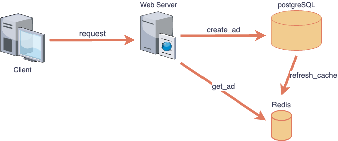
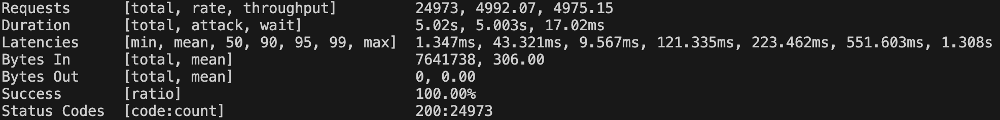

# Golang-gin-api-server

## Reference 
- https://frankhitman.github.io/zh-CN/gin-validator/
- https://blog.logrocket.com/gin-binding-in-go-a-tutorial-with-examples/

## How to Run
若只是要運行 API service，僅需要安裝 docker 即可，若要測試及開發才需要安裝 Go。

### Run API service
git clone 這個 repo，在 root directory 執行以下命令：
```
sudo docker compose up -d
```

## Testing
測試分為兩個部分，對一些基本的函數，如：資料處理、資料確認函數，進行 `unit test` ，對 API 進行 `integration test`，確認回傳結果正確。

### 單元測試 (Unit Test)
進入 `/controller` 資料夾，有針對 controller package 內的各個基本函數進行 unit test。
```
go test -v
```

### 整合測試 (Integration Test)
進入 `/testing` 資料夾，執行以下命令進行整合測試：
```
go test -v
```

對 API 的運作以及回傳結果進行測試，包括創建的廣告各項參數是否會成功使用 struct binding 驗證正確性，以及檢驗依照指定順序創建廣告，是否有符合預期的回傳結果。

Testcase 包含了特殊情況：
- 創建國家代碼不符合 `iso_3166-1` 規範的廣告
- 創建年齡範圍錯誤的廣告
- 創建 `Title` 為空的廣告
- 創建沒有 `StartAt`, `EndAt` 的廣告
- 創建不符合預期平台的廣告

## 設計想法
### 分析效能瓶頸
首先，在一般情境下『查詢廣告的次數』**會遠大於**『投放廣告的次數』，因此在實作上可以專注於提升查詢效能。

此次需求是 10,000 Requests Per Second 的 API，如果每次都要查詢 Database 一定會太慢，因此決定從這裡著手優化，爲了提升查詢的效能，可以考慮將『活躍廣告』存在記憶體中，以提升效能，也不用擔心會佔用過多記憶體，因為總活躍廣告數量不會超過 1000 個。

此專案選用 PostgreSQL 作為主要資料庫， Redis 作為 Cache，至於不直接存在記憶體是考量若後續有考量負載平衡的設計，還是需要有 Redis 才能共享 Cache 內的資源。

### 系統設計


儲存資料的部分主要分為 Database 以及 Cache 兩個部分，其中 DB 會儲存所有歷史廣告訊息，而 Cache 則是儲存 Active 的廣告。

- 每次 `create ad` 都會先將廣告放入資料庫，接著會重新尋找一次資料庫中 active 的廣告放入 Redis 中。
- 每次的查詢會從 Redis 中找到符合條件的廣告。

效率上，這樣的設計有效的避免了大量對資料庫的讀取，而每日寫入資料庫的動作又不會超過 3000 次，確保了服務的高效能；同時，優先放入資料庫也確保了廣告資料不為輕易遺失，畢竟每一筆客戶的資料都極為重要。

### 選擇使用工具
- GIN, Gorm, PostgreSQL, Redis, Vegeta

### Database Schema 設計
- 使用 `text` 儲存 `Title`，因為考量標題長度可能很長，且不需要對 Title 建立 index。
- 使用 `varchar` 陣列儲存 `Gender`、`Country`、`Platform`。
- 使用 `BIGINT` 儲存 `StartAt`、`EndAt`，考量用字串儲存需要花費更多的空間，且運算上並不會比較方便快速。
- 使用 `INT` 儲存 `AgeStart`、`AgeEnd`。

## 壓力測試
測試環境：
- Hardware: GCP e2-micro 
- OS: Ubuntu 22.04
- Testing Tool: [vegeta](https://github.com/tsenart/vegeta)

測試結果是 5000 requests per second，相信硬體如果再好一點，可以有機會達到 10000 requests per second。


## Structure
```
.
├── Dockerfile
├── README.md
├── controller
│   ├── Advertisements.go
│   ├── adFilter.go
│   ├── adResponse.go
│   └── controller.go # request handler
├── docker-compose.yml
├── go.mod
├── go.sum
├── images
├── main.go
├── router
│   └── router.go
├── storage
│   ├── cache.go # Redis Setting
│   └── database.go # PostgreSQL and ORM setting
├── testing
│   ├── cases.go
│   ├── create_data.sh
│   ├── create_large_data.sh
│   ├── main_test.go
│   └── testcase.go
├── types
│   └── adCreationReqeustBody.go
└── utils
    └── type.go

7 directories, 23 files
```