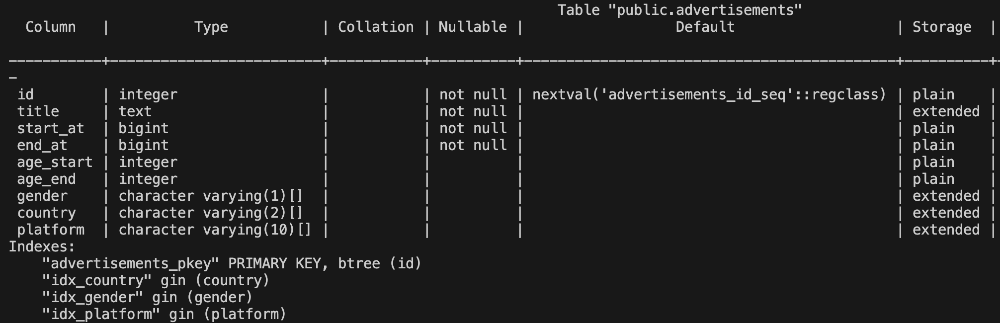

# Golang-gin-api-server

## Reference 
- https://frankhitman.github.io/zh-CN/gin-validator/
- https://blog.logrocket.com/gin-binding-in-go-a-tutorial-with-examples/

## How to Run
若只是要運行 API service，僅需要安裝 docker 即可，若要測試及開發才需要安裝 Go。

### Run API service
git clone 這個 repo，在 root directory 執行以下命令：
```
sudo docker compose up -d
```

### Run Testing
進入 `testing` 資料夾，執行以下命令進行整合測試：
```
go test
```

## 設計想法
### 分析效能瓶頸
首先，在一般情境下『查詢廣告的次數』**會遠大於**『投放廣告的次數』，因此在實作上可以專注於提升查詢效能。

爲了提升查詢的效能，可以考慮將『活躍廣告』存在記憶體中，以提升效能，也不用擔心會佔用過多記憶體，因為總活躍廣告數量不會超過 1000 個。

### 選擇使用工具
- GIN
    - Go 最常見的 web service 框架
- Gorm
    - Go 最常見的 ORM 框架
- PostgreSQL
    - 使用 RDBMS 方便進行 index 提升查詢效能
    - 選用 PostgreSQL 是因為支援 GIN index
- Vegeta
    - 教學淺顯易懂易學習，方便使用

### Database Schema 設計
- 使用 `text` 儲存 `Title`，因為考量標題長度可能很長，且不需要對 Title 建立 index。
- 使用 `varchar` 儲存 `Gender`、`Country`、`Platform`，並建立 index，加速查詢。
- 使用 `BIGINT` 儲存 `StartAt`、`EndAt`，考量用字串儲存需要花費更多的空間，且運算上並不會比較方便快速。
- 使用 `INT` 儲存 `AgeStart`、`AgeEnd`，以建立 index 加速查詢。

